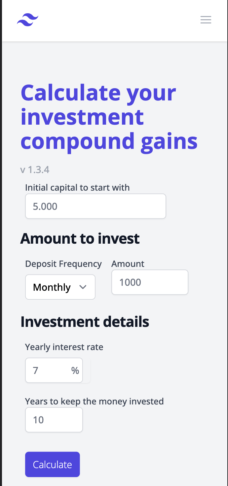
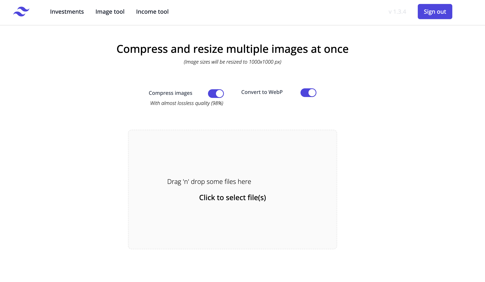
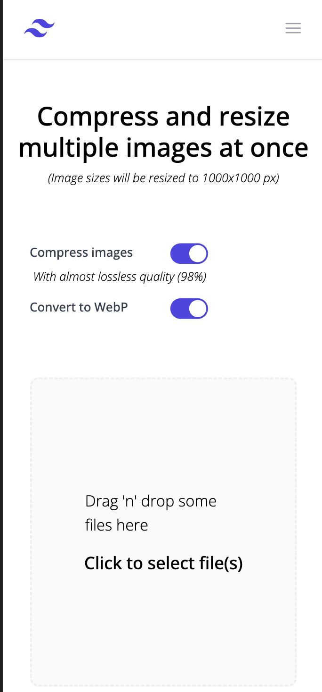

# Useful tools with Typescript

- Image conversion/compression/resizing tool
- Income and expenses calculator
- Compound interest calculator

### Technologies

- Typescript - _version_ `4.9.x`
- React - _version_ `18.x`
- NextJS - _version_ `13.x`
- Firebase - _version_ `9.x`
- TailwindCSS - _version_ `3.x`

## How to run

Make sure to create your own Firebase project and populate the `.env` file
with your project environment variables.

Then execute the following command in your shell

```bash
npm run dev
```

## Preview





